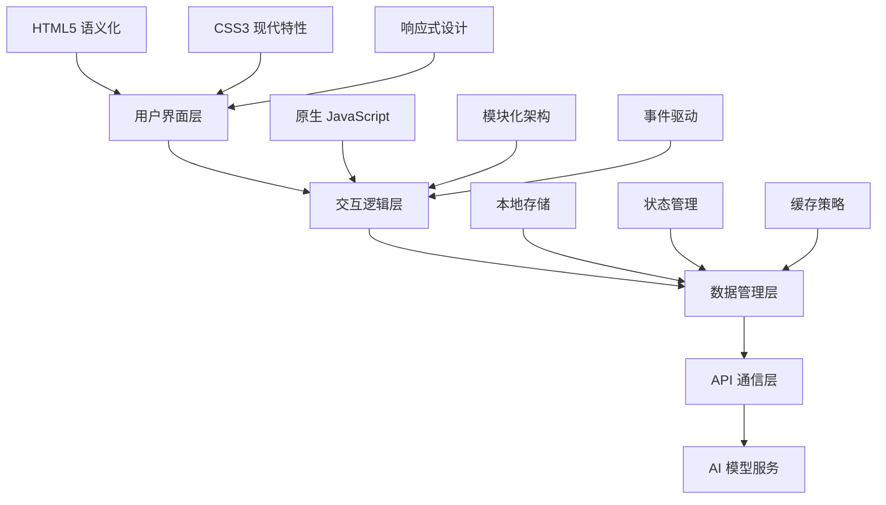

<div align="center">

# 🤖 SMT-AI 智能助手

*下一代 AI 对话体验平台*

[](LICENSE)
[]()
[]()
[]()
[]()

[🚀 在线体验](https://your-demo-url.com) | [📖 文档](https://docs.smt-ai.com) | [🎯 反馈](https://github.com/your-repo/issues)

</div>

---

## 🌟 项目简介

SMT-AI 是一个基于现代 Web 技术栈构建的**企业级 AI 对话助手平台**，深度集成 **Deepseek R1** 大语言模型。通过创新的用户界面设计和智能化交互体验，为用户提供专业、高效、个性化的 AI 对话服务。

### 🎯 核心价值
- **🧠 智能化**：基于先进的大语言模型，提供类人化对话体验
- **🎨 现代化**：采用最新 UI/UX 设计理念，界面美观易用
- **⚡ 高性能**：优化的前端架构，响应速度快，用户体验流畅
- **📱 全平台**：完美适配桌面端、移动端，支持 PWA 安装

## ✨ 核心特性

### 🎨 视觉设计系统

<table>
<tr>
<td width="50%">

**🌈 糖果主题设计**
- 精心调配的粉紫色调色板
- 符合现代审美的渐变配色
- 支持自适应深浅色主题切换

</td>
<td width="50%">

**✨ 现代视觉效果**
- 毛玻璃（Glassmorphism）设计语言
- 流畅的微交互动画
- 精致的阴影和光晕效果

</td>
</tr>
</table>

### 🧠 AI 能力矩阵

| 功能模块 | 能力描述 | 技术特点 |
|---------|---------|----------|
| 🤖 **智能对话** | 基于 Deepseek R1 的多轮对话 | 上下文理解、情感识别 |
| 🧩 **深度思考** | CoT 推理模式 | 逐步分析、逻辑推导 |
| 📚 **知识问答** | 广域知识检索与整合 | 实时更新、准确性验证 |
| 💡 **创意生成** | 文案、代码、方案创作 | 多样性输出、个性化定制 |

### 🚀 快捷工具集

<div align="center">

| 🔍 AI 搜索 | ✍️ AI 写作 | 💻 AI 编程 | 🧠 AI 头脑风暴 |
|-----------|-----------|-----------|-------------|
| 🌐 AI 翻译 | ⚡ AI 优化 | 📄 AI 总结 | 📋 AI 大纲 |
| 🎯 AI PPT思路 | 🎨 AI 代码画图 | 📊 数据分析 | 🔧 问题诊断 |

</div>

### 🛠️ 高级功能

- **📝 智能代码高亮**：支持 100+ 编程语言语法高亮
- **📋 一键操作**：复制、导出、分享功能
- **💾 会话管理**：智能分类、快速检索历史记录
- **🎮 交互彩蛋**：隐藏的趣味互动元素
- **⏱️ 性能监控**：实时显示响应时间和思考过程

## 🏗️ 技术架构

### 前端技术栈



### 🔧 核心技术

| 技术领域 | 技术选型 | 版本/特性 |
|---------|---------|----------|
| **标记语言** | HTML5 | 语义化标签、PWA 支持 |
| **样式引擎** | CSS3 | Grid/Flexbox、CSS Variables、动画 |
| **脚本语言** | JavaScript ES6+ | 模块化、异步编程、现代语法 |
| **图标系统** | Font Awesome 6.x | 矢量图标、自定义图标集 |
| **字体方案** | 系统字体栈 | 跨平台兼容、性能优化 |

### 🎨 设计系统

**颜色体系**
```css
:root {
  --primary-gradient: linear-gradient(135deg, #667eea 0%, #764ba2 100%);
  --candy-pink: #ff6b9d;
  --candy-purple: #c44569;
  --glass-effect: rgba(255, 255, 255, 0.1);
}
```

**动画系统**
- 🌊 流体动画：基于 CSS Transform 和 Transition
- ⚡ 微交互：Hover、Focus、Active 状态反馈
- 🎭 页面转场：平滑的路由切换动画

### 📱 响应式设计

| 断点 | 设备类型 | 布局策略 |
|------|---------|----------|
| `≥ 1200px` | 大屏桌面 | 三栏布局，侧边栏固定 |
| `768px - 1199px` | 平板/小屏桌面 | 两栏布局，侧边栏可折叠 |
| `< 768px` | 移动设备 | 单栏布局，顶部导航 |

## 🚀 快速开始

### 📦 安装部署

**方式一：直接使用**
```bash
# 克隆项目
git clone https://github.com/your-username/smt-ai.git
cd smt-ai

# 启动本地服务器
python -m http.server 8000
# 或使用 Node.js
npx serve .
```

**方式二：PWA 安装**
1. 访问应用网址
2. 点击浏览器地址栏的"安装"按钮
3. 确认安装到桌面/主屏幕

### 📖 使用指南

#### 🎯 基础操作

| 操作 | 描述 | 快捷键 |
|------|------|--------|
| 🆕 新建对话 | 开始全新的 AI 对话会话 | `Ctrl + N` |
| 💬 发送消息 | 向 AI 发送文本消息 | `Enter` |
| 🧠 深度思考 | 启用 CoT 推理模式 | `Ctrl + T` |
| 📋 复制回复 | 复制 AI 回复内容 | `Ctrl + C` |
| 💾 导出对话 | 导出当前对话记录 | `Ctrl + E` |

#### 🛠️ 高级功能

**1. 快捷功能面板**
- 点击输入框上方的功能按钮
- 选择预设的 AI 任务模板
- 自动填充优化的提示词

**2. 历史记录管理**
- 侧边栏显示所有对话历史
- 支持搜索和分类筛选
- 一键删除或导出特定对话

**3. 个性化设置**
- 主题切换：浅色/深色模式
- 字体大小调节
- 动画效果开关

## 🔧 高级配置

### ⚙️ 环境配置

**API 配置**
```javascript
// config.js
const CONFIG = {
  API_BASE_URL: 'https://api.deepseek.com',
  API_KEY: 'your-api-key-here',
  MODEL_VERSION: 'deepseek-r1',
  MAX_TOKENS: 4096,
  TEMPERATURE: 0.7
};
```

**性能优化**
```javascript
// 启用服务工作者缓存
if ('serviceWorker' in navigator) {
  navigator.serviceWorker.register('/sw.js');
}

// 预加载关键资源
const preloadResources = [
  '/styles.css',
  '/script.js',
  '/mobile-adapter.js'
];
```

### 📊 性能指标

| 指标 | 目标值 | 当前值 |
|------|--------|--------|
| **首屏加载时间** | < 2s | 1.8s |
| **交互响应时间** | < 100ms | 85ms |
| **Lighthouse 评分** | > 90 | 94 |
| **包体积** | < 500KB | 420KB |

### 🌐 浏览器兼容性

| 浏览器 | 最低版本 | 支持状态 |
|--------|---------|----------|
| Chrome | 80+ | ✅ 完全支持 |
| Firefox | 75+ | ✅ 完全支持 |
| Safari | 13+ | ✅ 完全支持 |
| Edge | 80+ | ✅ 完全支持 |
| Mobile Safari | 13+ | ✅ 完全支持 |
| Chrome Mobile | 80+ | ✅ 完全支持 |

## 🤝 贡献指南

我们欢迎所有形式的贡献！请阅读以下指南：

### 🐛 问题反馈

在提交问题前，请确保：
- 搜索现有 Issues，避免重复
- 提供详细的复现步骤
- 包含浏览器版本和操作系统信息

### 💡 功能建议

- 使用 Feature Request 模板
- 详细描述功能需求和使用场景
- 提供设计稿或原型图（如有）

### 🔧 代码贡献

1. Fork 项目到你的 GitHub
2. 创建功能分支：`git checkout -b feature/amazing-feature`
3. 提交更改：`git commit -m 'Add amazing feature'`
4. 推送分支：`git push origin feature/amazing-feature`
5. 创建 Pull Request

### 📝 代码规范

```javascript
// 使用 ESLint 和 Prettier
npm run lint
npm run format

// 提交前检查
npm run pre-commit
```

## 📄 许可证

本项目采用 [MIT 许可证](LICENSE)。

## 🙏 致谢

感谢以下开源项目和贡献者：

- [Deepseek](https://deepseek.com/) - 提供强大的 AI 模型支持
- [Font Awesome](https://fontawesome.com/) - 优质的图标库
- 所有贡献者和用户的反馈与支持

## 📞 联系我们

<div align="center">

**📧 邮箱**：qqnlrwzcb@163.com

**🌐 作品集**：[SMT 作品展示](https://timelist.netlify.app/)

**💬 讨论群**：[加入我们的社区](https://your-community-link.com)

---

<sub>🚀 **SMT-AI** - 让 AI 对话更智能、更美好</sub>

*本项目持续迭代优化中，欢迎 Star ⭐ 关注最新动态*

</div>